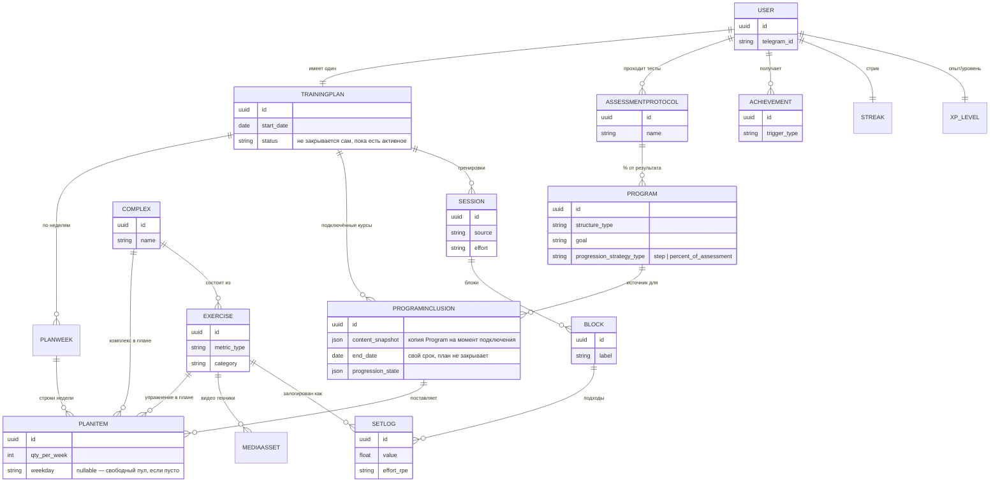

# Турникмэн → многокурсовая платформа: архитектура и план внедрения

Контекст: сейчас в проекте уже параллельно идёт (1) переход UI на
`@telegram-apps/telegram-ui` и (2) черновое проектирование сущностей
`Exercise / Program / Enrollment / Session`. Этот документ не заменяет ту
работу, а достраивает её до полной архитектуры и разбивает на волны для
кодинг-агентов, с ориентиром на функциональную модель Crimpd (дизайн —
отдельным заходом, после того как здесь всё зафиксировано).

Первый этап = функциональный Mini App, следующий — веб-версия (PWA) на той
же кодовой базе. Существующая логика подтягиваний не переписывается — она
становится первым источником контента для плана пользователя.

---

## 1. Принципы

- `domain/` остаётся чистым (без aiogram/SQLAlchemy) — расширяется, не переписывается.
- Прогрессия подтягиваний — не единственная зашитая формула, а первая реализация
  общего интерфейса `ProgressionStrategy`. Новые упражнения получают свои стратегии
  или переиспользуют существующие с другими константами (константы — в конфиге
  `Program`, не в коде — уже сформулированный урок).
- У пользователя **один активный план** (`TrainingPlan`), как у Crimpd — но в
  него можно одновременно подключить несколько готовых `Program` плюс свои
  упражнения. Параллельность — не в нескольких независимых треках, а в том,
  что план собирается из нескольких источников.
- Для каждого экрана — явно продуманное пустое/промежуточное состояние
  (только что подключил курс, ещё не прошёл первое занятие, план на паузе и т.д.) —
  нельзя предлагать действие, которое гарантированно не может завершиться успехом.
- Веб (PWA) и Mini App — один и тот же React-код; различается только слой
  аутентификации и upstream-обвязка (manifest/service worker).
- Никакого big-bang: переход на новую схему — через параллельное существование
  старой и новой моделей и контролируемый cutover, не одномоментная миграция.
- Геймификация — не примочка поверх, а часть модели с первого дня: ачивки,
  рекорды и стрики должны иметь для этого готовые точки данных в схеме, а не
  подкручиваться отдельным скриптом позже.

---

## 2. Доменная модель

### Контент (не зависит от пользователя)

| Сущность | Назначение | Ключевые поля |
|---|---|---|
| `Exercise` | Атомарное движение | `metric_type` (reps / time / weight / angle / distance), `category` → `subcategory` (иерархия, как у Crimpd), `variants` — по снаряду и по целевому RPE (A/B/C), `media` (см. ниже) |
| `Complex` | Именованная связка из нескольких разных `Exercise` (например, «комплекс на пресс» из 3 упражнений) | список входящих упражнений с их **собственными** sets/reps/rest у каждого — `Complex` не задаёт общий тайминг, только группирует для планирования и отображения; используется и как элемент `Program`, и как самостоятельный пункт каталога («сделать этот комплекс прямо сейчас») |
| `Program` | Источник контента для плана (курс/шаблон, = workout template или Skill Template) | `goal`, `structure_type` (`recurring` / `fixed` / `single_lesson`), недельная матрица из `Exercise`/`Complex` с количеством и фазой недели (Base/Rest/Peak), `progression_strategy_id`, конфиг констант, категория/подкатегория |
| `AssessmentProtocol` | Разовый тест-протокол (замер, тест на максимум) | не участвует в progression-каскаде, но имеет свой тренд/график; на результат (напр. 2ПМ) может ссылаться `Program` при расчёте % нагрузки |
| `MediaAsset` | Видео/фото техники упражнения | хранится на своём сервере (не YouTube — часть аудитории не откроет), отдаётся напрямую или через CDN перед своим VPS |

### План и прогресс (зависит от пользователя)

| Сущность | Назначение | Ключевые поля |
|---|---|---|
| `TrainingPlan` | Единственный активный план пользователя | **не ограничен по датам сам по себе** — существует, пока в нём есть хотя бы один активный `ProgramInclusion` или ручной `PlanItem`; список `PlanWeek` |
| `PlanWeek` | Неделя внутри плана | номер, дата начала, фаза (Base/Rest/Peak) |
| `ProgramInclusion` | Program × TrainingPlan — то, что раньше называлось `Enrollment` | **хранит снимок содержимого `Program` на момент подключения** (копия, не live-ссылка — изменения автора не долетают сами собой), своё состояние прогрессии, **свой срок действия** (курс заканчивается по расписанию независимо от общего плана); несколько `ProgramInclusion` могут сосуществовать в одном `TrainingPlan` |
| `PlanItem` | Строка недельной матрицы: конкретное упражнение на конкретную неделю | ссылка на `Exercise` (комплекс раскладывается на отдельные `PlanItem` — см. ниже), количество на неделю, **опциональная привязка к дню недели** (если не задана — попадает в «свободный пул» недели), `source` = `ProgramInclusion` (если пришло из курса) или `null` (добавлено вручную), `complex_id` — если пункт пришёл из комплекса (для группировки в UI); строки от разных источников **не объединяются автоматически**, даже если ссылаются на один `Exercise` |
| `Session` | Фактически выполненная тренировка | `source` (`plan` / `freeform` / `backdated`), связь с одним или несколькими `PlanItem` (комплекс закрывает сразу несколько плановых строк), блоки, план vs факт, общий `effort` |
| `Block` | Часть сессии | состав упражнений/комплексов, рабочие подходы + подход на максимум |
| `SetTarget` / `SetLog` | Подход: план и факт | значение + единица измерения, `effort`/RPE на подход, опциональная заметка |
| `ProgressionStrategy` | Интерфейс пересчёта — **две реализации с первого дня**, каждая с двумя режимами вызова | Режимы: `preview(...)` — сухой прогон, возвращает предполагаемые изменения target'ов без записи (нужен для подтверждения каскада при правке задним числом), и `apply(...)` — фактический пересчёт. Реализации: (1) шаговая — вход состояние `ProgramInclusion` + результаты последней `Session` (текущая логика подтягиваний); (2) процентная — вход результат `AssessmentProtocol` + процент из конфига `Program` (как «90% от 2ПМ» у Crimpd). Новые `Program` выбирают любую |

### Геймификация

| Сущность | Назначение | Ключевые поля |
|---|---|---|
| `Achievement` | Ачивка — глобальный реестр | `trigger_type` (личный рекорд по Exercise/AssessmentProtocol, завершение Program, стрик N дней, сезонный челлендж и т.д.) — **глобальные для пользователя**, но часть триггеров требует конкретных событий (новый максимум, пройденная программа) |
| `Streak` | Текущая серия дней/недель без пропуска | считается от `TrainingPlan`, не от отдельного курса |
| `XP` / уровень | Опыт за тренировки, конвертируется в уровень | начисляется за `Session` (с учётом объёма/интенсивности), не за сам факт логина — иначе обесценивается |
| `Leaderboard` | Сравнение с другими пользователями (уже в текущем роадмапе) | читает агрегаты из `Session`/`XP`/`Achievement`, не отдельный источник правды |
| `SeasonalChallenge` | Ограниченное по времени событие/челлендж | свой период действия, свой набор ачивок/XP-бонусов, не пересекается с обычной прогрессией курсов |

**Правила недели, отдыха и зачёта (зафиксировано):**

- **Невыполненное за неделю сгорает.** Новая неделя стартует с чистого
  листа, прогрессия назад не откатывается. Но: прошлая неделя остаётся
  открытой для внесения задним числом (человек мог потренироваться офлайн и
  забыть внести), и в итогах недели всегда видно план vs факт — сколько
  запланировано и сколько реально сделано.
- **Отдых зависит от источника, а не от плана целиком.** У `Program` есть
  своя `rest_policy`: жёсткая (подтягивания и подобные силовые курсы —
  минимум N дней между тренировками, бот/приложение не выдаёт план раньше)
  или мягкая (сборный план из разных курсов — не блокируем, но настойчиво
  предупреждаем, что перерыв важен для прогресса). Поле живёт на уровне
  `Program`/`Exercise`, не глобальной настройкой.
- **Комплекс — единица планирования, но не единица зачёта.** В план
  комплекс раскладывается на отдельные `PlanItem` (по одному на упражнение,
  с общим `complex_id` для группировки в UI). Сделал 2 из 3 упражнений —
  закрылись те 2 `PlanItem`, третий остался в плане. Никакого «частично
  выполнено» на уровне комплекса не существует.

**Обнаружение конфликтов при подключении курса.** Когда пользователь
подключает новый `Program` (создаётся `ProgramInclusion`), система
сравнивает его `PlanItem` с уже существующими в плане по совпадению
`Exercise` на пересекающихся неделях и показывает пользователю список
потенциальных дублей («у вас уже есть похожее упражнение из другого
источника»). Дальше — ручное решение пользователя: оставить оба, убрать
один из вариантов. Автоматического слияния нет — ровно то поведение,
которое ты описал на примере двух программ на подтягивания на одной руке.

**Важное упрощение благодаря единому плану:** раз план один, отпадает
изначально запланированная сложность с независимыми напоминаниями и
недельной нагрузкой на каждый `Enrollment` — расписание и напоминания
считаются **на весь `TrainingPlan`** («на этой неделе осталось сделать
X»), а не по каждому источнику отдельно. Это заметно проще предыдущего
варианта архитектуры (см. журнал решений в разделе 5).

Ключевое правило, перенесённое как есть: только freeform/backdated-сессии
не участвуют в каскаде пересчёта, но участвуют в статистике.
`ProgressionStrategy` для подтягиваний = текущий `domain/progression.py`,
вынесенный за интерфейс без изменения поведения.

### Карта связей (ERD)



Эту диаграмму видно как граф прямо в GitHub/большинстве редакторов markdown
(блок ```mermaid``` рендерится нативно) — не нужен отдельный инструмент,
чтобы посмотреть структуру.

---

## 3. Экранная архитектура (функционал, без дизайна)

| Экран | Функция | Что меняется относительно текущего бота |
|---|---|---|
| **Dashboard** | Единый план: что осталось сделать на этой неделе (пул + расставленное по дням), стрик, быстрый старт «сделать что-то из невыполненного» | Раньше — список Enrollment, теперь — один план с несколькими источниками контента |
| **Каталог программ** | Список Program по категориям, карточка, кнопка «Подключить к плану» → создаёт `ProgramInclusion` | На старте — один пункт (подтягивания) |
| **Редактор плана (календарь по неделям)** | Матрица «упражнение/комплекс × неделя», количество на клетку, фаза недели, **ручное перетаскивание по дням или оставление в свободном пуле** | Новый — календарное представление на несколько недель вперёд, с несколькими источниками (курсы + ручные добавления) в одной сетке |
| **Экран сессии (pre)** | Разминка, цели на сегодня | Обобщается под Block/Exercise/Complex вместо хардкода блоков А/Б |
| **Экран сессии (live)** | Пошаговое логирование, таймеры (get_ready → go → rest с раскрывающейся панелью лога: resistance, RPE-слайдер, заметка) | Существует — становится metric-type-agnostic и умеет комплексы (несколько разных упражнений подряд) |
| **Итог сессии** | Разбор результата, превью новых target'ов, что из плана закрыто | Существует, обобщается |
| **История/лог** | По плану целиком, с фильтром по источнику (курсу) | Существует для подтягиваний, добавляется фильтр |
| **Аналитика** | Графики по упражнению/категории, сводка по всему плану, CSV-экспорт | Существует SVG-графики — расширяются на несколько источников |
| **Библиотека тестов в профиле** | Карточки `AssessmentProtocol` с трендом, пустое состояние «тест не пройден» | Новый — обобщение текущего «замера» |
| **Конструктор своей тренировки/комплекса** | Выбор упражнения из библиотеки (поиск + создание нового), настройка подходов/повторов/отдыха, сборка в `Complex`, сохранение в «Мои тренировки» | Новый — пользовательский контент поверх каталога |
| **Профиль** | Нормативы, лидерборд, подписка, стрик, ачивки, напоминания на уровне плана | Напоминания переезжают с уровня пользователя на уровень `TrainingPlan` |

---

## 4. Технические решения по слоям

**Backend.** FastAPI-слой получает CRUD/read эндпоинты для
`TrainingPlan / ProgramInclusion / PlanItem / Session` параллельно со старыми
хендлерами бота — до контролируемого cutover. Бот сужается до онбординга,
напоминаний и текстового фолбэка; Mini App/веб — основная поверхность.

**Напоминания.** APScheduler-воркер (опрос каждые 15 минут, по часовому
поясу) считает готовность **на весь `TrainingPlan`**, не по каждому курсу —
упрощение по сравнению с прошлой версией архитектуры, где напоминания
планировались per-Enrollment. Поскольку рекомендованная аутентификация веб-
версии — тот же Telegram-аккаунт (см. ниже), бот может слать напоминания
пользователю независимо от того, где тот фактически тренируется — в Mini
App или в PWA-версии на телефоне.

**Видео/медиа.** По твоему решению — свои ролики на сервере, не YouTube
(часть аудитории не откроет YouTube без VPN). Нужен слой хранения
(объектное хранилище, например MinIO/S3-совместимое, или просто раздача
статики с VPS через nginx) плюс свой плеер в UI. Не блокирует MVP функционала —
можно поднимать по мере наполнения контента, но стоит заложить `MediaAsset`
в схему сразу, чтобы не переделывать модель `Exercise`.

**Веб-версия как PWA.** Ключевое уточнение: сайт должен не просто открываться
в браузере, а устанавливаться на экран телефона и вести себя как приложение
без браузерного окружения — тот же приём, что у банковских приложений после
удаления из сторов. Технически: `manifest.json` (иконка, `display: standalone`,
имя), service worker (минимум для установки — полноценный офлайн-кэш не
обязателен на старте), HTTPS. Это меняет роадмап: пункт «Мобильное
приложение» из исходного документа по факту закрывается PWA-версией сайта, а
не отдельной нативной разработкой — нативное приложение остаётся опцией
только если после 100 подписчиков выяснится, что PWA всё же недостаточно.

**Аутентификация веб-версии.** Рекомендация — Telegram Login Widget (тот же
user_id, без дублирования модели пользователя), проще для self-hosted на
одном VPS и не плодит вторую систему идентичности. Email/пароль — запасной
вариант, если понадобится доступ без Telegram вообще.

**Миграция данных.** Текущий прогресс по подтягиваниям → один `Program`
(seed) + один `ProgramInclusion` в `TrainingPlan` на каждого активного
пользователя, через одноразовый backfill-скрипт. Старые таблицы не
удаляются до валидации cutover на проде.

**UI-компоненты.** Логирование подхода — компонент, рендерящийся по
`metric_type` упражнения, а не хардкодится под блоки А/Б. Блок сессии умеет
разворачиваться в несколько упражнений подряд (комплекс), не только одно.

---

## 5. Технические риски — заложить в архитектуру, не «допилить потом»

Три вещи, которые невозможно добавить поверх готового кода без переписывания.
Их надо решить в волнах 3–5, а не откладывать.

**1. Фоновый таймер.** Crimpd — нативное приложение и может держать таймер,
звук и вибрацию при заблокированном экране. Mini App и PWA — не могут: JS
замораживается, когда вкладка уходит в фон. Для тренировки с висами по 7
секунд и отдыхом по 2 минуты это критично. Решения, которые надо заложить
сразу:
- таймер считается **по абсолютным timestamp'ам** (время окончания фазы), а
  не счётчиком-декрементом — тогда возврат в приложение показывает
  корректное состояние, даже если вкладка спала;
- `Wake Lock API` — держать экран включённым во время активной сессии;
- беззвучный аудио-луп через Web Audio как фолбэк, чтобы вкладка не
  засыпала (приём из веб-плееров);
- звуковые сигналы конца фазы планируются заранее через Web Audio
  `scheduleAtTime`, а не по срабатыванию таймера.

**2. Офлайн-логирование.** В зале плохая сеть. Если каждый подход уходит
отдельным запросом, часть данных теряется. Нужно: состояние активной сессии
живёт локально (IndexedDB), логирование подходов идёт в локальную очередь,
синхронизация — фоновая с ретраями. Это определяет форму всех API
логирования (идемпотентные запросы с клиентским `session_id`, batch-приём
подходов), поэтому проектируется до написания эндпоинтов, а не после.
`TanStack Query` + `Workbox` закрывают почти всё, свой велосипед не нужен.

**3. Ревизия под реальный код.** Волны 0–2 (вынос `ProgressionStrategy`,
аддитивные миграции, backfill) написаны по паспорту проекта, без доступа к
текущей кодовой базе. Перед их постановкой агентам нужно сверить с реальной
схемой БД, содержимым `domain/` и списком существующих миграций — иначе
задачи не лягут на существующий код.

---

## 6. Журнал решений (зафиксировано в этом чате)

- **Один план вместо нескольких параллельных Enrollment.** У пользователя
  всегда один активный `TrainingPlan`, но в него можно подключить сразу
  несколько `Program` (`ProgramInclusion`) плюс добавлять свои упражнения —
  как у Crimpd, но с возможностью смешивать несколько готовых курсов в одной
  сетке.
- **Привязка к дням — опциональная.** `PlanItem` можно закрепить за днём
  недели или оставить в общем пуле «сделать в течение недели, в любом
  порядке» — оба режима сосуществуют в одном плане.
- **Комплексы.** Упражнение в плане может быть одиночным (`Exercise`) или
  связкой из нескольких разных упражнений (`Complex`), выполняемых подряд.
- **Видео — свой хостинг**, не YouTube, из-за проблем с доступом у части
  аудитории.
- **Геймификация — глобальная**: ачивки за рекорды/программы, плюс XP/уровни
  за тренировки, лидерборд и сезонные челленджи — часть модели с первого
  дня, не отдельная фича поверх.
- **Веб-версия = PWA** (устанавливаемый сайт), а не промежуточный шаг перед
  нативным приложением — нативное приложение становится опцией «если PWA
  окажется недостаточно», а не запланированным следующим этапом.
- **Комплекс — только группировка для планирования.** Отдых у каждого
  входящего упражнения свой; комплекс не задаёт общий тайминг/суперсет.
- **Пересечение курсов не сливается автоматически.** Если два подключённых
  `Program` предлагают одинаковое упражнение на одной неделе, обе строки
  показываются раздельно с пометкой источника, а при подключении курса
  система подсвечивает такие пересечения и даёт пользователю вручную убрать
  дубль — как ты делал в Crimpd с двумя программами на подтягивания на
  одной руке.
- **Контент курса — снимок, не live-ссылка.** `ProgramInclusion` копирует
  содержимое `Program` на момент подключения; если автор потом меняет
  программу, у уже подключивших её пользователей ничего не меняется само
  собой.
- **План бессрочный, курсы внутри — со сроком.** `TrainingPlan` не
  заканчивается по дате, пока в нём есть хоть один активный
  `ProgramInclusion` или ручной пункт; при этом каждый подключённый курс
  может иметь свою длительность (например, 6-недельный Skill Template) и
  корректно завершается сам, не закрывая весь план.
- **Прогрессия — два типа сразу.** Кроме шаговой (уже есть у подтягиваний,
  target +1/-1 по объёму), с первого дня поддерживается процентная — target
  как % от результата `AssessmentProtocol` (аналог «90% от 2ПМ» у Crimpd).
  Обе — реализации одного интерфейса `ProgressionStrategy`.
- **Невыполненное за неделю сгорает**, но прошлая неделя остаётся открытой
  для внесения задним числом, и в итогах недели видно план vs факт.
- **`rest_policy` — свойство `Program`, не глобальная настройка.** Силовые
  курсы (подтягивания) жёстко блокируют выдачу плана раньше срока; сборный
  план из разных курсов только настойчиво предупреждает.
- **Комплекс — единица планирования, но не зачёта.** Раскладывается на
  отдельные `PlanItem` с общим `complex_id`; состояния «частично выполнен»
  не существует.
- **Завершение курса → выбор следующего.** Когда `ProgramInclusion`
  доходит до конца, пользователю предлагается выбрать следующий курс из
  каталога. Никаких автоматических продолжений и цепочек «A → B» в модели
  не нужно — курс просто закрывается, план продолжает жить.
- **XP — фиксированно за каждую завершённую тренировку.** Не за объём, не
  за неделю — самое простое и предсказуемое правило, не требует расчёта
  «сложности» тренировки.
- **Каскад пересчёта — с подтверждением.** При правке тренировки задним
  числом система сначала показывает, какие последующие target'ы изменятся,
  и просит подтверждение; пересчёт применяется только после согласия.
  Это меняет интерфейс `ProgressionStrategy` — нужна функция «сухого
  прогона» (dry-run), возвращающая предполагаемые изменения без записи,
  отдельно от применения. Заложить в волне 0, иначе придётся
  переписывать.

---

## 7. Что ещё полезно уточнить

1. Референс по **дизайну** — теперь, когда модель (единый план, комплексы,
   геймификация, PWA) зафиксирована, можно смотреть его без риска
   перерисовывать экраны заново.

---

## 8. План внедрения по волнам

Волны рассчитаны на формат «issue → `@claude` → PR → регрессионные тесты»,
без монолитных задач.

| Волна | Содержание | Критерий готовности |
|---|---|---|
| **0** | Вынести `progression.py` за интерфейс `ProgressionStrategy` с двумя режимами вызова (`preview` — сухой прогон без записи, `apply` — пересчёт); добавить вторую реализацию — процентную (от `AssessmentProtocol`) | Существующие юнит-тесты прогрессии проходят без изменений; `preview` возвращает те же значения, что затем применяет `apply`; процентная реализация покрыта своими тестами |
| **1** | Миграции: `Exercise / Complex / Program / AssessmentProtocol / TrainingPlan / PlanWeek / ProgramInclusion / PlanItem / Session / Block / SetTarget / SetLog` (аддитивно) | Схема существует, не используется в проде |
| **2** | Backfill: текущая программа подтягиваний → `Program` (seed) + `TrainingPlan` с одним `ProgramInclusion` на каждого активного пользователя | Прогон на копии прод-БД даёт консистентные данные |
| **3** | FastAPI CRUD/read-эндпоинты для новой схемы, параллельно со старыми | Покрыты тестами, не подключены к текущему UI |
| **4** | Dashboard во фронтенде — единый план (пока один источник — подтягивания), без изменения UX тренировки | Визуально то же, что сейчас, но через новую модель данных |
| **5** | Обобщение экрана сессии под `Block/Exercise/Complex` (metric-type-agnostic логирование, комплекс = несколько `PlanItem` подряд) + **офлайн-слой: IndexedDB для активной сессии, очередь логов, идемпотентные batch-эндпоинты** | Существующий флоу подтягиваний работает через обобщённый компонент; тренировка логируется без сети и досинхронизируется |
| **5a** | Live-таймер: расчёт по абсолютным timestamp'ам, Wake Lock, предпланируемые звуки Web Audio | Таймер показывает корректное состояние после сворачивания приложения и блокировки экрана |
| **6** | Каталог программ (пока один пункт) + подключение к плану через «Начать» → `ProgramInclusion` (снимок содержимого на момент подключения, свой срок действия); детектор пересечений по `Exercise` между источниками при подключении | Онбординг нового пользователя идёт через каталог; конфликт двух похожих упражнений подсвечивается и решается вручную; обновление исходной `Program` автором не трогает уже подключивших |
| **7** | Cutover: старые хардкод-эндпоинты бота отключаются, всё через новую схему | Старые таблицы можно архивировать |
| **8** | Геймификация: ачивки на новых триггерах (рекорд/программа/стрик), XP фиксированно за завершённую тренировку, лидерборд, сезонные челленджи поверх новой схемы | Ачивки и XP срабатывают на реальных событиях из новой модели |
| **9** | PWA: `manifest.json`, service worker, установка на экран, веб-аутентификация через Telegram Login Widget | Сайт устанавливается на телефон и открывается без браузерного UI |
| **10** | Свой видео-хостинг для `MediaAsset` (объектное хранилище + плеер) | Видео техники доступно без VPN |
| **11** | Второй курс как dogfooding-проверка: два `ProgramInclusion` в одном плане одновременно | Пересечение по упражнениям/неделям обрабатывается корректно, без правок в логике подтягиваний |

Волны 0–3 не видны пользователю и безопасны для параллельной разработки.
Волны 4–7 — контролируемый, поэтапный cutover текущего продакшна.
Волны 8–10 — геймификация, PWA и медиа можно вести параллельно после 7.
Волна 11 — финальная проверка, что архитектура действительно
многокурсовая, а не многокурсовая на бумаге.
